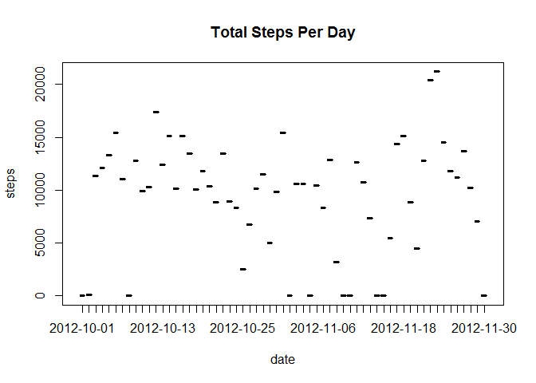
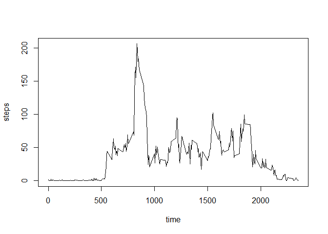
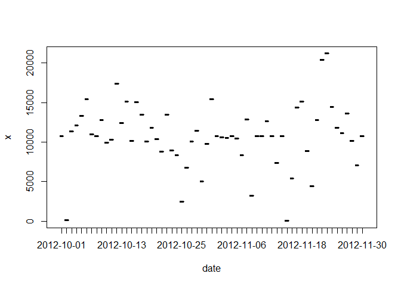
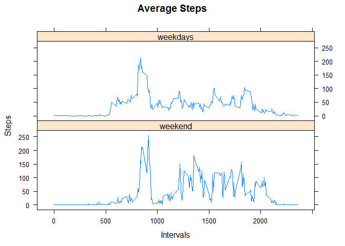

# Reproducible Research: Peer Assessment 1


## Loading and preprocessing the data

```r
# setwd("C:\\Users\\jukoesma\\Documents\\GitHub\\RepData_PeerAssessment1");
# unzip("activity.zip");
activity <- read.csv("activity.csv");
```
## What is mean total number of steps taken per day?

1.Calculate the total number of steps taken per day

```r
s = aggregate(activity$steps, by=list(date=activity$date), FUN=sum, na.rm = TRUE)
s
```

```
##          date     x
## 1  2012-10-01     0
## 2  2012-10-02   126
## 3  2012-10-03 11352
## 4  2012-10-04 12116
## 5  2012-10-05 13294
## 6  2012-10-06 15420
## 7  2012-10-07 11015
## 8  2012-10-08     0
## 9  2012-10-09 12811
## 10 2012-10-10  9900
## 11 2012-10-11 10304
## 12 2012-10-12 17382
## 13 2012-10-13 12426
## 14 2012-10-14 15098
## 15 2012-10-15 10139
## 16 2012-10-16 15084
## 17 2012-10-17 13452
## 18 2012-10-18 10056
## 19 2012-10-19 11829
## 20 2012-10-20 10395
## 21 2012-10-21  8821
## 22 2012-10-22 13460
## 23 2012-10-23  8918
## 24 2012-10-24  8355
## 25 2012-10-25  2492
## 26 2012-10-26  6778
## 27 2012-10-27 10119
## 28 2012-10-28 11458
## 29 2012-10-29  5018
## 30 2012-10-30  9819
## 31 2012-10-31 15414
## 32 2012-11-01     0
## 33 2012-11-02 10600
## 34 2012-11-03 10571
## 35 2012-11-04     0
## 36 2012-11-05 10439
## 37 2012-11-06  8334
## 38 2012-11-07 12883
## 39 2012-11-08  3219
## 40 2012-11-09     0
## 41 2012-11-10     0
## 42 2012-11-11 12608
## 43 2012-11-12 10765
## 44 2012-11-13  7336
## 45 2012-11-14     0
## 46 2012-11-15    41
## 47 2012-11-16  5441
## 48 2012-11-17 14339
## 49 2012-11-18 15110
## 50 2012-11-19  8841
## 51 2012-11-20  4472
## 52 2012-11-21 12787
## 53 2012-11-22 20427
## 54 2012-11-23 21194
## 55 2012-11-24 14478
## 56 2012-11-25 11834
## 57 2012-11-26 11162
## 58 2012-11-27 13646
## 59 2012-11-28 10183
## 60 2012-11-29  7047
## 61 2012-11-30     0
```


2. If you do not understand the difference between a histogram and a barplot, research the difference between them. Make a histogram of the total number of steps taken each day

```r
plot(s$date, s$x, freq = TRUE, main = "Total Steps Per Day", border = par("fg"), 
     density = NULL, angle = 45, lty = NULL, 
     sub = NULL,  xlab = "date", ylab = "steps"
     )
```

 

3.Calculate and report the mean and median of the total number of steps taken per day

```r
# Calculating Mean and Median
ma <- aggregate(activity$steps, by=list(date=activity$date), FUN = mean, na.rm = TRUE)
mda <- aggregate(activity$steps, by=list(date=activity$date), FUN = median, na.rm = TRUE)

# Tidying up the output
names(ma)[2] <- "mean"
names(mda)[2] <- "median"
agga <- cbind(ma, mda$median)

# Produce the Results
agga
```

```
##          date       mean mda$median
## 1  2012-10-01        NaN         NA
## 2  2012-10-02  0.4375000          0
## 3  2012-10-03 39.4166667          0
## 4  2012-10-04 42.0694444          0
## 5  2012-10-05 46.1597222          0
## 6  2012-10-06 53.5416667          0
## 7  2012-10-07 38.2465278          0
## 8  2012-10-08        NaN         NA
## 9  2012-10-09 44.4826389          0
## 10 2012-10-10 34.3750000          0
## 11 2012-10-11 35.7777778          0
## 12 2012-10-12 60.3541667          0
## 13 2012-10-13 43.1458333          0
## 14 2012-10-14 52.4236111          0
## 15 2012-10-15 35.2048611          0
## 16 2012-10-16 52.3750000          0
## 17 2012-10-17 46.7083333          0
## 18 2012-10-18 34.9166667          0
## 19 2012-10-19 41.0729167          0
## 20 2012-10-20 36.0937500          0
## 21 2012-10-21 30.6284722          0
## 22 2012-10-22 46.7361111          0
## 23 2012-10-23 30.9652778          0
## 24 2012-10-24 29.0104167          0
## 25 2012-10-25  8.6527778          0
## 26 2012-10-26 23.5347222          0
## 27 2012-10-27 35.1354167          0
## 28 2012-10-28 39.7847222          0
## 29 2012-10-29 17.4236111          0
## 30 2012-10-30 34.0937500          0
## 31 2012-10-31 53.5208333          0
## 32 2012-11-01        NaN         NA
## 33 2012-11-02 36.8055556          0
## 34 2012-11-03 36.7048611          0
## 35 2012-11-04        NaN         NA
## 36 2012-11-05 36.2465278          0
## 37 2012-11-06 28.9375000          0
## 38 2012-11-07 44.7326389          0
## 39 2012-11-08 11.1770833          0
## 40 2012-11-09        NaN         NA
## 41 2012-11-10        NaN         NA
## 42 2012-11-11 43.7777778          0
## 43 2012-11-12 37.3784722          0
## 44 2012-11-13 25.4722222          0
## 45 2012-11-14        NaN         NA
## 46 2012-11-15  0.1423611          0
## 47 2012-11-16 18.8923611          0
## 48 2012-11-17 49.7881944          0
## 49 2012-11-18 52.4652778          0
## 50 2012-11-19 30.6979167          0
## 51 2012-11-20 15.5277778          0
## 52 2012-11-21 44.3993056          0
## 53 2012-11-22 70.9270833          0
## 54 2012-11-23 73.5902778          0
## 55 2012-11-24 50.2708333          0
## 56 2012-11-25 41.0902778          0
## 57 2012-11-26 38.7569444          0
## 58 2012-11-27 47.3819444          0
## 59 2012-11-28 35.3576389          0
## 60 2012-11-29 24.4687500          0
## 61 2012-11-30        NaN         NA
```

## What is the average daily activity pattern?

1.Make a time series plot (i.e. type = "l") of the 5-minute interval (x-axis) and the average number of steps taken, averaged across all days (y-axis)

```r
a = aggregate(activity$steps, by=list(interval = activity$interval), FUN=mean, na.rm = TRUE)
plot(a$interval, a$x, type = "l", xlab = "time", ylab = "steps")
```

 

2.Which 5-minute interval, on average across all the days in the dataset, contains the maximum number of steps?


```r
a[which.max(a$x), ]$interval
```

```
## [1] 835
```

## Imputing missing values

1.Calculate and report the total number of missing values in the dataset (i.e. the total number of rows with NAs)

```r
sum(is.na(activity$steps))
```

```
## [1] 2304
```

2.Devise a strategy for filling in all of the missing values in the dataset. The strategy does not need to be sophisticated. For example, you could use the mean/median for that day, or the mean for that 5-minute interval, etc.

```r
# Define a function that gets the corresponding mean values for the same interval
m <- function(j) { a[a$interval == j,]$x }
```

3.Create a new dataset that is equal to the original dataset but with the missing data filled in.

```r
# New dataset is in ca
ca <- activity
ca[is.na(ca$steps),]$steps <- sapply(ca[is.na(ca$steps),]$interval, FUN = m)
```

4.Make a histogram of the total number of steps taken each day and Calculate and report the mean and median total number of steps taken per day. 


```r
sca <- aggregate(ca$steps, by=list(date=ca$date), FUN=sum, na.rm = TRUE)
mca <- aggregate(ca$steps, by=list(date=ca$date), FUN=mean, na.rm = TRUE)
mdca <- aggregate(ca$steps, by=list(date=ca$date), FUN=median, na.rm = TRUE)
plot(sca)
```

 

Do these values differ from the estimates from the first part of the assignment? What is the impact of imputing missing data on the estimates of the total daily number of steps?

```r
names(mca)[2] <- "mean"
names(mdca)[2] <- "median"
aggca <- cbind(mca, mdca$median)

names(aggca)[3] <- "median"
aggca
```

```
##          date       mean   median
## 1  2012-10-01 37.3825996 34.11321
## 2  2012-10-02  0.4375000  0.00000
## 3  2012-10-03 39.4166667  0.00000
## 4  2012-10-04 42.0694444  0.00000
## 5  2012-10-05 46.1597222  0.00000
## 6  2012-10-06 53.5416667  0.00000
## 7  2012-10-07 38.2465278  0.00000
## 8  2012-10-08 37.3825996 34.11321
## 9  2012-10-09 44.4826389  0.00000
## 10 2012-10-10 34.3750000  0.00000
## 11 2012-10-11 35.7777778  0.00000
## 12 2012-10-12 60.3541667  0.00000
## 13 2012-10-13 43.1458333  0.00000
## 14 2012-10-14 52.4236111  0.00000
## 15 2012-10-15 35.2048611  0.00000
## 16 2012-10-16 52.3750000  0.00000
## 17 2012-10-17 46.7083333  0.00000
## 18 2012-10-18 34.9166667  0.00000
## 19 2012-10-19 41.0729167  0.00000
## 20 2012-10-20 36.0937500  0.00000
## 21 2012-10-21 30.6284722  0.00000
## 22 2012-10-22 46.7361111  0.00000
## 23 2012-10-23 30.9652778  0.00000
## 24 2012-10-24 29.0104167  0.00000
## 25 2012-10-25  8.6527778  0.00000
## 26 2012-10-26 23.5347222  0.00000
## 27 2012-10-27 35.1354167  0.00000
## 28 2012-10-28 39.7847222  0.00000
## 29 2012-10-29 17.4236111  0.00000
## 30 2012-10-30 34.0937500  0.00000
## 31 2012-10-31 53.5208333  0.00000
## 32 2012-11-01 37.3825996 34.11321
## 33 2012-11-02 36.8055556  0.00000
## 34 2012-11-03 36.7048611  0.00000
## 35 2012-11-04 37.3825996 34.11321
## 36 2012-11-05 36.2465278  0.00000
## 37 2012-11-06 28.9375000  0.00000
## 38 2012-11-07 44.7326389  0.00000
## 39 2012-11-08 11.1770833  0.00000
## 40 2012-11-09 37.3825996 34.11321
## 41 2012-11-10 37.3825996 34.11321
## 42 2012-11-11 43.7777778  0.00000
## 43 2012-11-12 37.3784722  0.00000
## 44 2012-11-13 25.4722222  0.00000
## 45 2012-11-14 37.3825996 34.11321
## 46 2012-11-15  0.1423611  0.00000
## 47 2012-11-16 18.8923611  0.00000
## 48 2012-11-17 49.7881944  0.00000
## 49 2012-11-18 52.4652778  0.00000
## 50 2012-11-19 30.6979167  0.00000
## 51 2012-11-20 15.5277778  0.00000
## 52 2012-11-21 44.3993056  0.00000
## 53 2012-11-22 70.9270833  0.00000
## 54 2012-11-23 73.5902778  0.00000
## 55 2012-11-24 50.2708333  0.00000
## 56 2012-11-25 41.0902778  0.00000
## 57 2012-11-26 38.7569444  0.00000
## 58 2012-11-27 47.3819444  0.00000
## 59 2012-11-28 35.3576389  0.00000
## 60 2012-11-29 24.4687500  0.00000
## 61 2012-11-30 37.3825996 34.11321
```
Based on the values above, yes patterns look different, the mean is higher and the median has less NA values.


## Are there differences in activity patterns between weekdays and weekends?

1.Create a new factor variable in the dataset with two levels - "weekday" and "weekend" indicating whether a given date is a weekday or weekend day.

```r
# Define lbw function that determines if date is a weekend or not.
lbw <- function(d) {weekdays(d, abbreviate = TRUE) %in% c("Sat", "sun")}

# Set weekend/weekdays value
wca <- cbind(ca[, c("interval", "steps")], sapply(as.Date(ca$date), FUN = lbw))
names(wca)[3] = "weekend"
wca.f <- factor(wca$weekend, levels=c(TRUE, FALSE), labels=c("weekend", "weekdays"))
```

2.Make a panel plot containing a time series plot (i.e. type = "l") of the 5-minute interval (x-axis) and the average number of steps taken, averaged across all weekday days or weekend days (y-axis). See the README file in the GitHub repository to see an example of what this plot should look like using simulated data.


```r
wca$weekend <- wca.f
 
# Aggregate the values
awca <- aggregate(wca$steps, by=list(interval = wca$interval, weekend = wca$weekend), FUN = mean)

# Draw
library("lattice")
xyplot(x~interval|weekend, data=awca,
    main="Average Steps",
    xlab="Intervals",
    ylab="Steps", type="l")
```

 
